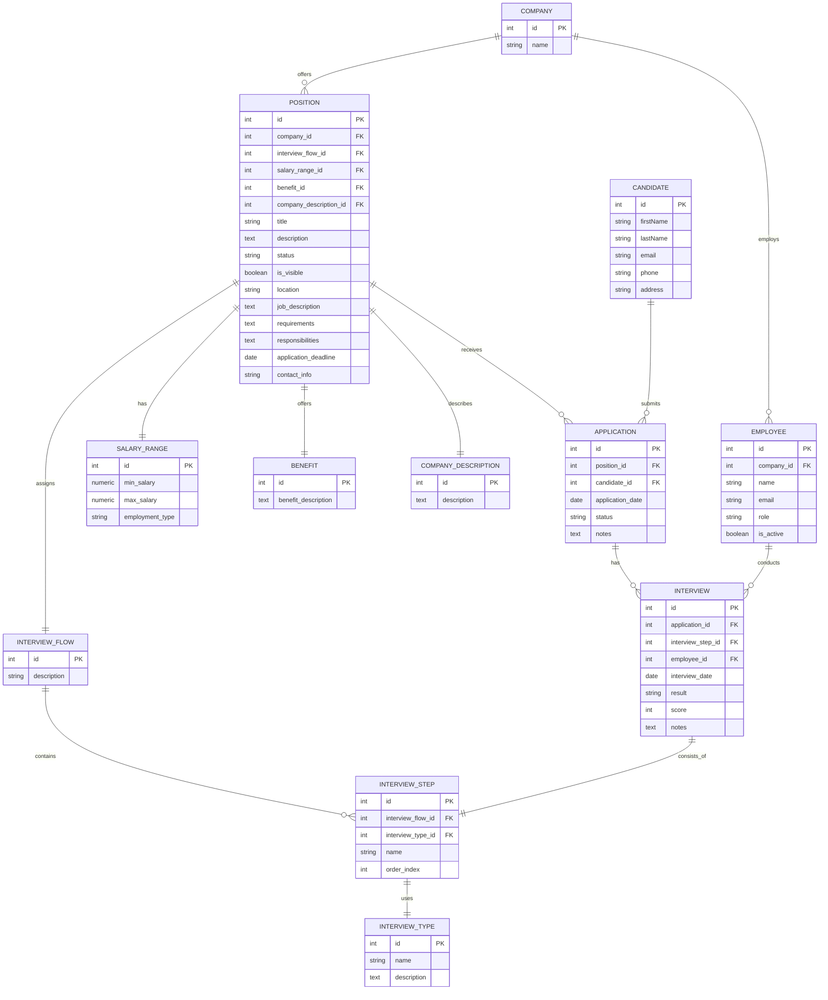

```mermaid
erDiagram
COMPANY {
    int id PK
    string name
}
EMPLOYEE {
    int id PK
    int company_id FK
    string name
    string email
    string role
    boolean is_active
}
POSITION {
    int id PK
    int company_id FK
    int interview_flow_id FK
    int salary_range_id FK
    int benefit_id FK
    int company_description_id FK
    string title
    text description
    string status
    boolean is_visible
    string location
    text job_description
    text requirements
    text responsibilities
    date application_deadline
    string contact_info
}
SALARY_RANGE {
    int id PK
    numeric min_salary
    numeric max_salary
    string employment_type
}
BENEFIT {
    int id PK
    text benefit_description
}
COMPANY_DESCRIPTION {
    int id PK
    text description
}
INTERVIEW_FLOW {
    int id PK
    string description
}
INTERVIEW_STEP {
    int id PK
    int interview_flow_id FK
    int interview_type_id FK
    string name
    int order_index
}
INTERVIEW_TYPE {
    int id PK
    string name
    text description
}
CANDIDATE {
    int id PK
    string firstName
    string lastName
    string email
    string phone
    string address
}
APPLICATION {
    int id PK
    int position_id FK
    int candidate_id FK
    date application_date
    string status
    text notes
}
INTERVIEW {
    int id PK
    int application_id FK
    int interview_step_id FK
    int employee_id FK
    date interview_date
    string result
    int score
    text notes
}

COMPANY ||--o{ EMPLOYEE : employs
COMPANY ||--o{ POSITION : offers
POSITION ||--|| INTERVIEW_FLOW : assigns
POSITION ||--|| SALARY_RANGE : has
POSITION ||--|| BENEFIT : offers
POSITION ||--|| COMPANY_DESCRIPTION : describes
INTERVIEW_FLOW ||--o{ INTERVIEW_STEP : contains
INTERVIEW_STEP ||--|| INTERVIEW_TYPE : uses
POSITION ||--o{ APPLICATION : receives
CANDIDATE ||--o{ APPLICATION : submits
APPLICATION ||--o{ INTERVIEW : has
INTERVIEW ||--|| INTERVIEW_STEP : consists_of
EMPLOYEE ||--o{ INTERVIEW : conducts
```
