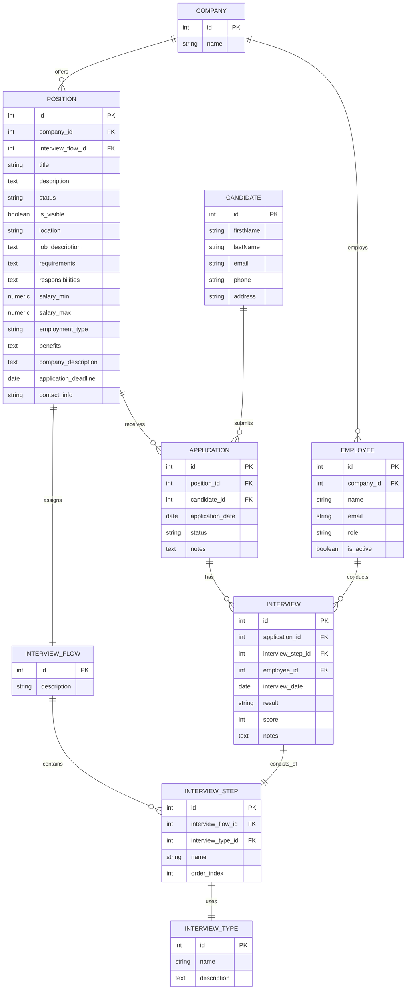

use the following mermaid diagram to updathe the database schemas from @schema.prisma 


- - -

```
Error code: P1012
error: Error parsing attribute "@relation": The relation fields `position` on Model `InterviewFlow` and `interviewFlow` on Model `Position` both provide the `references` argument in the @relation attribute. You have to provide it only on one of the two fields.
  -->  prisma\schema.prisma:107
```
Please help me debug this code. Only debug the latest error.

- - - 

Nota: despues de un par de intentos el asistentente no encontro el error,era: 
```
model Position {
  ...
  interviewFlowId     Int             @unique
  interviewFlow       InterviewFlow   @relation(fields: [interviewFlowId], references: [id])
  ...
}

model InterviewFlow {
  ...
  position        Position?       
}
```
- - - 
Would you suggest any index on any table to improve performance?

ChatGPT4 suggestions:
1. Candidate Table
    Email
    Name
2. Company Table
    Name
3. Position Table
    CompanyID
    InterviewFlowID
4. Employee Table
    CompanyID
    Email
5. Education, WorkExperience, Resume, Application, and Interview Tables
    CandidateID and other Foreign Keys
6. Application and Interview Tables
    PositionID, ApplicationID, InterviewStepID, and EmployeeID
- - - 
Add indexes on the following fields:
Position.companyId
Application.positionId
Education.candidateId
Experience.candidateId
Interview.applicationId
